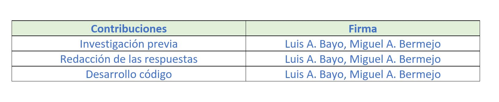

```{r setup, include=FALSE}
knitr::opts_chunk$set(echo = TRUE)
```


***
# Presentación
***

En esta práctica se elabora un caso práctico orientado a aprender a identificar los datos
relevantes para un proyecto analítico y usar las herramientas de integración, limpieza, validación y análisis de las mismas.

Se entregará un solo archivo `github`con la solución:

+ https://github.com/luisalbertobayo/titanic


***
# Competencias
***

En esta práctica se desarrollan las siguientes competencias del Máster de Data Science:

+ Capacidad de analizar un problema en el nivel de abstracción adecuado a cada situación y aplicar las habilidades y conocimientos adquiridos para abordarlo y resolverlo.

+ Capacidad para aplicar las técnicas específicas de tratamiento de datos (integración, transformación, limpieza y validación) para su posterior análisis.


***
# Objetivos
***

Los objetivos concretos de esta práctica son:

+ Aprender a aplicar los conocimientos adquiridos y su capacidad de resolución de problemas en entornos nuevos o poco conocidos dentro de contextos más amplios o multidisciplinares.

+ Saber identificar los datos relevantes y los tratamientos necesarios (integración, limpieza y validación) para llevar a cabo un proyecto analítico.

+ Aprender a analizar los datos adecuadamente para abordar la información contenida en los datos.

+ Identificar la mejor representación de los resultados para aportar conclusiones sobre el problema planteado en el proceso analítico.

+ Actuar con los principios éticos y legales relacionados con la manipulación de datos en función del ámbito de aplicación.

+ Desarrollar las habilidades de aprendizaje que les permitan continuar estudiando de un modo que tendrá que ser en gran medida autodirigido o autónomo.

+ Desarrollar la capacidad de búsqueda, gestión y uso de información y recursos en el ámbito de la ciencia de datos.


***
# Contenido
***
El objetivo de esta actividad será el tratamiento de el dataset:

+ Titanic: Machine Learning from Disaster (https://www.kaggle.com/c/titanic)

Las diferentes tareas a realizar siguiendo las principales etapas de un proyecto analítico son las siguientes:

1. Descripción del dataset. ¿Por qué es importante y qué pregunta/problema pretende responder?

2. Integración y selección de los datos de interés a analizar.

3. Limpieza de los datos.

3.1. ¿Los datos contienen ceros o elementos vacíos? ¿Cómo gestionarías cada uno de estos casos?
3.2. Identificación y tratamiento de valores extremos.

4. Análisis de los datos.
  
4.1. Selección de los grupos de datos que se quieren analizar/comparar (planificación de los análisis a aplicar).
4.2. Comprobación de la normalidad y homogeneidad de la varianza.
4.3. Aplicación de pruebas estadísticas para comparar los grupos de datos. En función de los datos y el objetivo del estudio, aplicar pruebas de contraste de hipótesis           correlaciones, regresiones, etc. Aplicar al menos tres métodos de análisis diferentes.

5. Representación de los resultados a partir de tablas y gráficas.

6. Resolución del problema. A partir de los resultados obtenidos, ¿cuáles son las conclusiones? ¿Los resultados permiten responder al problema?

7. Código: Hay que adjuntar el código, preferiblemente en R, con el que se ha realizado la limpieza, análisis y representación de los datos. Si lo preferís, también podéis trabajar en Python.


***
# Librerías
***

Librerías necesarias para el desarrollo de la actividad:

*__'knitr'__*, permite integrar código R en archivos de distintos formato.

*__'lubridate'__*, facilita las operaciones básicas con variables de tipo fecha y/o tiempo.

*__'stringr'__*, entre otras funciones, permite la manipulación de caracteres individuales dentro de las cadenas en los vectores de caracteres, incluyendo el trabajo con espacios en blanco.

*__'plyr'__*,  conjunto de herramientas que resuelve un conjunto común de problemas. Permite dividir un problema en partes manejables, operar en cada pieza y luego volver a unir todas.

*__'dplyr'__*, permite trabajar con objetos del dataframe, tanto en la memoria como fuera de ella.

*__'nortest'__*, permite probar la hipótesis compuesta de normalidad mediante diferentes. pruebas.

*__'ggplot2'__*, permite generar gráficos para crear gráficos elegantes y complejos.

```{r load_libraries, include=FALSE, warning=FALSE}
#install.packages('knitr')
#install.packages('lubridate')
#install.packages('stringr')
#install.packages('plyr')
#install.packages('dplyr')
#install.packages('nortest')
#install.packages('ggplot2')


#Carga de los paquetes R instalados.
library(knitr)
library(lubridate)
library(stringr)
library(plyr)
library(dplyr)
library(nortest)
library(ggplot2)

```


***
# Resolución
***

***
## Descripción del dataset
***

Se ha escogido el dataset  _Titanic: Machine Learning from Disaster_ (https://www.kaggle.com/c/titanic), recomendado en el enunciado de la práctica.
El conjunto de datos para el análisis contiene 12 atributos (columnas) y 1309 muestras (filas).

+ **PassengerId**, identificador del pasajero.

+ **Survived**, variable booleana que indica si el pasajero sobrevivió al hundimiento (1) o no (0).

+ **Pclass**, clase en la que viajaba el pasajero. Puede tomar los valores de: 1 = 1st; 2 = 2nd; 3 = 3rd.

+ **Name**, nombre del pasajero.

+ **Sex**, género del pasajero.

+ **Age**, edad del pasajero.

+ **SibSp**, número de familiares de segundo grado de parentesco (hermanos y hermanastros) más cónyuge abordo con los que viaja el pasajero.

+ **Parch**, número de familiares de primer grado de parentesco (padres e hijos) abordo con los que viaja el pasajero.

+ **Ticket**, número identificativo del ticket.

+ **Fare**,tarifa del ticket.

+ **Cabin**, número de camarote.

+ **Embarked**, puerto en el que embarcó el pasajero: C = Cherbourg; Q = Queenstown; S = Southampton.


***
## Importancia y objetivos de los análisis
***

Se quiere realizar un estudio demográfico para averiguar qué características comunes reúnen los pasajeros que no sobrevivieron en base a los datos conocidos y observar que atributos de estos pudieron influir más en el hecho.

Este dataset da opción al diseño de un modelo de _machine learning_ al poder entrenar al modelo con el fin de predecir si un pasajero sobrevive en base a sus datos conocidos mediante modelos de regresión.


***
## Integración y selección de los datos de interés a analizar.
***

El dataset está divido en dos archivos:

+ training set (**train.csv**)

+ test set (**test.csv**)


El set de entrenamiento, _train.csv_, tiene la finalidad de usarse para construir el modelo de aprendizaje automático, pues contiene los 12 atributos definidos anteriormente, incluida la variable **Survived** para cada pasajero.

El fichero de pruebas, _test.csv_, debería usarse para la validación de la calidad del modelo de _machine learning_, pues contiene datos invisibles al no dar a conocer si el pasajero sobrevivió o no (exclusión del atributo **Survived**).

Comentar que en el _Kaggle_ se incluye un tercer archivo, *gender_submission*, compuesto solo por dos atributos, **PassengerId** y una predicción donde se asume que sólo sobreviven las mujeres referente al dataset de pruebas _test.csv_. Por lo que no se hará uso de él.


***
## Limpieza de los datos
***

Se hace uso de la función `read.csv()` para leer los archivos **train.csv** y **test.csv** a estudio.

```{r}
# read data
datos_train <- read.csv(file="train.csv", header=TRUE, sep=",", strip.white=TRUE, encoding="UTF-8")
datos_test <- read.csv(file="test.csv", header=TRUE, sep=",", strip.white=TRUE, encoding="UTF-8")
```


Una vez leidos se unifican ambos dataset en uno, **master**, dimensionándolo con la estructura del dataset **train**.

```{r warning=FALSE}
datos_master <- bind_rows(datos_train, datos_test)
filas = dim(datos_train)

nomAtributos <- names(datos_master)
```


Para concer la asignación que R ha realizado de cada atributo se hace uso de `sapply()`.

```{r}
#Tipos de variables
asignacionAtribR <- sapply(datos_master, class)

character <- c(4, 9, 11)
factor <- c(2, 3, 5, 10, 12)
integer <- c(1, 7, 8)
numeric <- c(6, 10)
claseAtributos <- vector(mode="character",length=ncol(datos_master))
claseAtributos[character] <- "character"
claseAtributos[factor] <- "factor"
claseAtributos[integer] <- "integer"
claseAtributos[numeric] <- "numeric"
difAtribConR <- nomAtributos[asignacionAtribR != claseAtributos]
```

Se han encontrado como asignaciones erróneas los atributos:
`r toString(difAtribConR)`

De manera que la conversión necesaria a realizar es:

```{r}
kable(data.frame(variables = difAtribConR, clase = c("factor", "factor", "factor")))
```

```{r include=FALSE}
datos_master$Survived <- as.factor(datos_master$Survived)
datos_master$Pclass <- as.factor(datos_master$Pclass)
datos_master$Age <- as.numeric(datos_master$Age)
datos_master$Embarked <- as.factor(datos_master$Embarked)
```


Comentar que se ha considerado el atributo **age** como una variable cuantitativa continua, pues la edad que normalmente se da en años, se puede precisar más y dar en unidades más pequeñas al año como pueden ser los meses. Y sería el caso que se aplica aquí, pues hay varios registros que recogen decimales en su valor, definiendo al atributo **age** como una variable cuantitativa continua.


Visualización descriptiva de los datos.

```{r}
summary(datos_master)
```


En base al planteamiento que se quiere llevar a cabo, hay ciertos atributos que no serían de interés para el estudio, pues no aportan datos significativos para el análisis. Como son **Name**, **Ticket** y **Cabin**.
Por ello, se decide eliminarlos.

```{r}
datos_master_Anls <- datos_master[, -(4)]
datos_master_Anls <- datos_master_Anls[, -(8)]
datos_master_Anls <- datos_master_Anls[, -(9)]

head(datos_master_Anls)
```


***
### Ceros y elementos vacíos
***

Es muy importante conocer si existen valores nulos (campos vacíos) y la distribución de los valores que poseen las variables para asi poder realizar una correcta intepretación de ellos.

```{r message=FALSE, warning=FALSE}
#Búsqueda de valores vacíos en atributos declarados como números, (NA), o como cadena de #caracteres, ("").
colSums(is.na(datos_master_Anls))
colSums(datos_master_Anls == "")
```


Como era de esperar, se observan los 418 registros procedentes del archivo **test.csv** que no tienen valores para el atributo **Survived**. De esta manera, se decide eliminarlos, pues **Survived** es un atributo esencial en el que se centra el estudio de los datos, y haciéndolo, aún habría datos suficientes para obtener conclusiones sin sesgar los resultados.

```{r}
datos_master_Anls <- datos_master_Anls[which(datos_master_Anls$Survived!="NA"),]
```


Para los valores vacíos del atributo **Age**, se decide completarlos con la media del propio atributo.

```{r}
datos_master_Anls$Age[is.na(datos_master_Anls$Age)] <- round(mean(datos_master_Anls$Age, na.rm = T), digits = 2)
```


El valor vacío encontrado en el atributo **Fare** no se considera ya que corresponde a un registro procedente del archivo **test.csv**, de manera que se ha eliminado con el borrado de estos.

En el atributo **Embarked** hay dos registros vacíos para los que se les asigna el valor _C_ (_Cherbourg_).

```{r}
datos_master_Anls$Embarked[datos_master_Anls$Embarked == ""] = "C"
```


Una vez trabajodos los datos vacíos y no habiendo encontrado ningún registro no interpretable bajo definición de los atributos, el dataset a estudio presenta la siguente dimensión.

```{r}
dim(datos_master_Anls)

summary(datos_master_Anls)
```

**master_clean** contiene `r nrow(datos_master_Anls)` registros y `r ncol(datos_master_Anls)` atributos, siendo estos: `r toString(names(datos_master_Anls))`.


***
### Valores extremos
***

A continuación se comprueba si existe la presencia en el dataset de valores extremos/atípicos(*outliers*), tanto máximos como mínimos en cada uno de sus atributos, de manera que se identifiquen aquellos posibles valores que parecen inconsistentes con el resto de registros.
El uso de estos valores en cálculos probabilísticos puede dar lugar a errores o desviaciones en las estimaciones, por ejemplo en la media.

Uno de los métodos más visuales para poder identificar estos valores es mediante la representación gráfica de diagramas de cajas o _boxplot_, ya que permite observar todos estos valores (mínimos y máximos) y la distribución que toma el resto del conjunto.

Se procede con ello para el atributo **Age**.

```{r}
boxplot(datos_master_Anls$Age, main = "Distribución de la edad", col = "orange", border = "brown", horizontal = TRUE, notch = TRUE)
```

Se observa que existen _outliers_ máximos (cercanos a 80) y mínimos (cercanos a 0) pero que están dentro del rango válido para el atributo que representan, ya que corresponderían a bebés y a pasajeros de edad avanzada. Por ello se mantienen en la muestra.

Extendiendo la misma representación para las variables de **SibSp**, **Parch** y **Fare**:

```{r}
boxplot(datos_master_Anls$SibSp, main = "Distribución de familiares segundo grado", col = "orange", border = "brown", horizontal = TRUE, notch = TRUE)
boxplot(datos_master_Anls$Parch, main = "Distribución de familiares primer grado", col = "orange", border = "brown", horizontal = TRUE, notch = TRUE)
boxplot(datos_master_Anls$Fare, main = "Distribución de la tarifa del ticket", col = "orange", border = "brown", horizontal = TRUE, notch = TRUE)

```

A pesar de que en estos casos también se observan _outliers_, las variables toman valores dentro de los márgenes reales del atributo que definen.
Los pasajeros viajan en su mayoría no acompañados de familiares de segundo grado de parentesco (hermanos y hermanastros) o cónyuges, definido por la variable *SibSp*, ni por familiares de primer grado de parentesco, definido por la variable *Parch*.
Aún así se necesitaría un análisis más profundamente para ver la distribución de los atributos y darles una interpretación detallada más allá de un primer vistazo gráfico.

Aunque es importante destacar que con esta representación se ha conseguido el objetivo de observar que no exsiten valores fuera de un rango real en cuanto a valores que toman las variables según lo que representan.

Este análisis es aplicable al atributo **Fare** en el que existen _outliers_ que también se consideran dentro de rango del de precios.
De hecho, se ha comprobado que el valor _outlier_ más alejado de la media, que corresponde a un valor de billete de £512,13 (presumublemente en libras esterlinas), que se aproxima mucho a la información encontrada en diferentes portales web que cita como fuente los archivos de las Cortes de Distrito de los Estados Unidos y lo asocia a las personas relacionadas en el dataset con ese billete. Aún así, la información puede variar muy ligeramente de un portal web a otro por lo que se comenta solo como una curiosidad sin nombrar a las fuentes, pero que para el análisis da cierta credibilidad en ese _outlier_, y de ahí la decisión de mantenerlo.


Una vez que se ha acometido sobre el conjunto de datos inicial los procedimientos de integración, validación y limpieza anteriores, se genera un nuevo fichero de salida denominado **master_clean.csv**.

```{r}
new.datos_master_Anls <- "master_clean.csv"
write.csv(datos_master_Anls, file = new.datos_master_Anls, row.names = FALSE)
```


***
## Análisis de los datos
***

Con objetivo de explicar las principales características de los mismos, y así tratar de responder a las preguntas planteadas en el marco del proyecto de datos.

***
### Selección de los grupos de datos a analizar
***

Se generan los grupos de datos que pueden resultar interesantes para el análisis.

```{r}
# Asociación en base a supervivencia
pasajeros.SIsobrevive <- datos_master_Anls[datos_master_Anls$Survived == "1",]
pasajeros.NOsobrevive <- datos_master_Anls[datos_master_Anls$Survived == "0",]

# Asociación en base al género
pasajeros.hombre <- datos_master_Anls[datos_master_Anls$Sex == "male",]
pasajeros.mujer <- datos_master_Anls[datos_master_Anls$Sex == "female",]

# Asociación en base a la clase de billete
pasajeros.hombre <- datos_master_Anls[datos_master_Anls$Pclass == "1",]
pasajeros.mujer <- datos_master_Anls[datos_master_Anls$Pclass == "2",]
pasajeros.mujer <- datos_master_Anls[datos_master_Anls$Pclass == "3",]

# Asociación en base al acompañamientos de familiares.
pasajeros.SIconSegun <- datos_master_Anls[datos_master_Anls$SibSp > "0",]
pasajeros.NOconSegun <- datos_master_Anls[datos_master_Anls$SibSp == "0",]
pasajeros.SIconPrim <- datos_master_Anls[datos_master_Anls$Parch > "0",]
pasajeros.NOconPrim <- datos_master_Anls[datos_master_Anls$Parch == "0",]
```


***
### Normalidad y homogeneidad de la varianza
***

Como comprobación de que los registros de los atributos cuantitativos tienen origen en una población con distribución normal, se hace uso de la prueba de normalidad de **Anderson-Darling**.
Es decir, se comprueba que para cada prueba se obtiene un p-valor superior al **nivel de significación**. Para esto, dado que no se conoce su $\alpha$ (**nivel de significación**), y sabiendo que su fijación no es un probelma estrictamente matemático, se decide utilizar el valor estándar que se suele dar de $\alpha$ = 0,05, lo que significa que, aunque la hipótesis nula sea cierta, los datos de cinco de cada cien muestras harán rechazarla. Es decir, se acepta que se puede rechazar la hipótesis nula de forma equivocada cinco de cada cien veces.

De cumplirse esto, se considera que el atributo a estudio contiene una distribución normal.

```{r}
alpha = 0.05

nomAtributos = names(datos_master_Anls)

if (ncol(datos_master_Anls) >0){
  cat("Atributos que no están definidos bajo una distribución normal:\n")
}

for (i in 1:ncol(datos_master_Anls)) {
  
  if (is.integer(datos_master_Anls[,i]) | is.numeric(datos_master_Anls[,i])) {
    p_value = ad.test(datos_master_Anls[,i])$p.value
    
    if (p_value < alpha) {
      cat(nomAtributos[i])
      if (i < ncol(datos_master_Anls) - 1) {
        cat(", ")
      }
    }
  }
}
```

Para corroborar esta asunción de normalidad en los atributos comentados: **Age**, **SibSp**, **Parch** y **Fare**, se hace uso del gráfico Q-Q.
Se obvia **PassengerID**, porque es tan solo el identificador del pasajero y no aportaría información al análisis de pruebas estadísticas.
Para una muestra de tamaño _n_, se dibujan _n_ puntos con los (n+1)-cuantiles de la distribución normal, en el eje horizontal el estadístico de k-ésimo orden, (para k = 1, ..., n) de la muestra en el eje vertical.
Si la distribución de la variable es la misma que la distribución de comparación se obtendrá, aproximadamente, una línea recta, especialmente cerca de su centro, cargando de normalidad al conjunto de valores.

+ Normal frente a representación Q-Q de **Age**:

```{r}
qqnorm(datos_master_Anls$Age);qqline(datos_master_Anls$Age, col = 'red')
```

+ Normal frente a representación Q-Q de **SibSp**:

```{r}
qqnorm(datos_master_Anls$SibSp);qqline(datos_master_Anls$SibSp, col = 'red')
```

+ Normal frente a representación Q-Q de **Parch**:

```{r}
qqnorm(datos_master_Anls$Parch);qqline(datos_master_Anls$Parch, col = 'red')
```

+ Normal frente a representación Q-Q de **Fare**:

```{r}
qqnorm(datos_master_Anls$Fare);qqline(datos_master_Anls$Fare, col = 'red')
```

Como se observan desviaciones sustanciales de la linealidad, se rechazan sus hipótesis nulas $h_0$ de similitud y se aceptarían sus hipótesis alternativas $h_1$, que afirman que la muestra de datos de **Age**, **SibSp**, **Parch** y **Fare** no siguen una distribución normal.


Respecto a la homogeneidad de la varianza se hace uso del test de **Fligner-Killeen**.
Este trata de la alternativa no paramétrica, utilizada cuando los datos no cumplen con la condición de normalidad.
De esta manera se decide comprobar la homogeneidad referente a los grupos definidos de pasajeros que viajan solos o acompañados (por parientes de primer o segundo grado).
Como se sabe, para el test, la hipótesis nula, $H_0$, asume igualdad de varianzas en los diferentes grupos de datos.

Comentar que, como el atributo **Survived** es una variable cualitativa nominal, se decide duplicarla en un nuevo atributo, **SurvivedCD**, con el fin de redefinirla como una variable cuantitativa discreta para poder resolver la homogeneidad de la varianza mediante el test de **Fligner-Killeen**, y así no generar inconsistencias en análisis posteriores al cambiar su identidad.

```{r}
datos_master_Anls$SurvivedCD <- datos_master_Anls$Survived
datos_master_Anls$SurvivedCD <- as.integer(datos_master_Anls$SurvivedCD)

fligner.test(SurvivedCD ~ SibSp, data = datos_master_Anls)
fligner.test(SurvivedCD ~ Parch, data = datos_master_Anls)
```

Dado que en ambos resultados el valor de p-value es menor que $\alpha$ (**nivel de significación**), se rechaza la hipótesis nula de homocedasticidad conlcuyendo que el atributo **Survived** presenta varianzas estadísticamente diferentes para los grupos de **SibSp** y **Parch**.


***
## Pruebas estadísticas
***

Aplicación de diversas pruebas estadísticas con el objetivo de responder a preguntas que relacionen los distintos atributos del juego de datos.

Este tipo de análisis tiene por objetivo modelar los datos a través de la distribución conocida. Sabiendo que el conjunto de datos estudiado representa una fracción de la totalidad de la población _titanic_, su objetivo es inferir cómo es esa población, asumiendo un grado de error en las estimaciones por el hecho de disponer de una muestra reducida de los datos. 

Los siguientes apartados describen algunos ejemplos de análisis de este tipo, como son la comparación de grupos mediante los contrastes de hipótesis, las regresiones o las correlaciones.


***
### Correlación
***

Se realiza un análisis de _correlación_ entre los distintos atributos, con el fin de aprender cuál de ellos influye más sobre la supervivencia de un pasajero.

Como el coeficiente de correlación es una medida asociada entre dos variables, se estudia en las variables cuantitativas:  **Age**, **SibSp**, **Parch** y **Fare**. Se obvia **PassengerID**, porque es tan solo el identificador del pasajero y no aportaría información al análisis de pruebas estadísticas.

Como se ha analizado antes, todas ellas no siguen una distribución normal, por lo que se aplica el _coeficiente de correlación de Spearman_, que aparece como una alternativa no paramétrica que mide el grado de dependencia entre dos variables.
(Se continua trabajando con el atributo _survived_ como variable cuantitativa discreta, **SurvivedCD**, para poder calcular el coeficiente de correlación de Spearman al operar este con vectores numéricos)

Relación entre la edad del pasajero y su posibilidad de supervivencia.

```{r warning=FALSE}
spearman_test_Age_Survived = cor.test(datos_master_Anls$Age, datos_master_Anls$SurvivedCD, method = "spearman")
spearman_test_Age_Survived = spearman_test_Age_Survived$estimate
```


Relación entre viajar con o sin familiares (el pasajero) y su posibilidad de supervivencia (la del pasajero a estudio).

```{r warning=FALSE}
spearman_test_SibSp_Survived = cor.test(datos_master_Anls$SibSp, datos_master_Anls$SurvivedCD, method = "spearman")
spearman_test_SibSp_Survived = spearman_test_SibSp_Survived$estimate

spearman_test_Parch_Survived = cor.test(datos_master_Anls$Parch, datos_master_Anls$SurvivedCD, method = "spearman")
spearman_test_Parch_Survived = spearman_test_Parch_Survived$estimate
```


Relación entre el valor del billete del pasajero y su posibilidad de supervivencia.

```{r warning=FALSE}
spearman_test_Fare_Survived = cor.test(datos_master_Anls$Fare, datos_master_Anls$SurvivedCD, method = "spearman")
spearman_test_Fare_Survived = spearman_test_Fare_Survived$estimate
```


```{r warning=FALSE}
cat(" Coef. correlación Age =", spearman_test_Age_Survived, "\n",
     "Coef. correlación SibSp =", spearman_test_SibSp_Survived, "\n",
     "Coef. correlación Parch =", spearman_test_Parch_Survived, "\n",
     "Coef. correlación Fare =", spearman_test_Fare_Survived, "\n")
```

Para identificar cuáles son las variables más correlacionadas con el atributo **Survived**, se observa la proximidad del coeficiente de correlación de Spearman con los valores "-1" o "1", pues estos extremos indican una correlación perfecta. Por el contrario, "0", marca la ausencia de correlación. Comentar también que el signo es negativo cuando los atributos a estudio son indirectamente proporcionales, y el signo es positivo cuando los atributos a estudio son directamente proporcionales.

De esta manera, se aprecia una total ausencia de correlación para los atributos **Age**, **SibSp** y **Parch**, pues el valor de su coeficiente es muy cercano a 0. Y, aunque para el coeficiente de correlación para el atributo **Fare** es algo más elevado, **0,32**, sigue siendo un valor bajo que marca ausencia de correlación.


Se decide observar también si puede haber relación entre el precio del billete y la edad del pasajero.
A priori, parece lógico pensar que la edad puede tener una relación directa con el precio del billete. 

```{r warning=FALSE} 
spearman_test_Fare_Age = cor.test(datos_master_Anls$Fare, datos_master_Anls$Age, method = "spearman")
spearman_test_Fare_Age = spearman_test_Fare_Age$estimate
cat(" Coef. correlación Fare_Age =", spearman_test_Fare_Age, "\n")
```

Como se puede ver, el valor de correlación es muy pequeño, lo que indica una ausencia de correlación asumible.


***
### Contraste de hipótesis
***

Como segunda prueba estadística se decide observar si el precio del billete es superior o inferior dependiendo del sexo del pasajero (hombre o mujer), dado que como se ha visto en el análisis de la correlación, los atributos cuantitativos presentan una ausencia de relación con la supervivencia de los pasajeros.

Para ello, se lleva acabo un contraste de hipótesis sobre las muestras a estudio: **Sex** y **Fare**.

```{r}
pasajeros.mujer.precio <- datos_master_Anls[datos_master_Anls$Sex == "female",]$Fare
pasajeros.hombre.precio <- datos_master_Anls[datos_master_Anls$Sex == "male",]$Fare
```

Como hay ausencia de normalidad, hay que aplicar tests no paramétricos. El test de _suma de rangos de Wilcoxon_, también llamado _Mann-Whitney U-test_ es el equivalente no paramétrico al _test t_ para dos muestras independientes.

Como se parte del supuesto establecido en el que los datos no presentan una distribución normal, las hipótesis planteadas se hacen en base a las medianas $Me$.

* Hipótesis nula: la mediana del precio de los billetes para mujeres ($Me_M$) es igual a la mediana del precio de los billetes para hombres ($Me_H$):

$H_0: Me_M = Me_H$
$H_0: Me_M - Me_H = 0$

* Hipótesis alternativa: la mediana del precio de los billetes para mujeres ($Me_M$) es distinta de la mediana del precio de los billetes para hombres ($Me_H$):

$H_1: Me_M \neq Me_H$

Siendo un contraste bilateral para la hipótesis alternativa.


Se aplica ahora el **test de la U de Mann-Whitney**, sabiendo que la fijación de $\alpha$ (**nivel de significación**) no es un probelma estrictamente matemático y se decide utilizar el valor estándar que se suele dar de $\alpha$ = 0,05.

```{r, eval=TRUE, echo=TRUE}
u.mannwhitney <- wilcox.test(pasajeros.mujer.precio, pasajeros.hombre.precio, alternative = "two.sided", paired = FALSE, exact = FALSE, conf.level = 0.95)
u.mannwhitney
```

Se obtiene un **pvalor** mucho menor que el **nivel de significación** $\alpha$ 0.05.
Por tanto, se rechaza la hipótesis nula $H_0$, pudiendo concluir que el precio del billete es significativamente diferente dependiendo de si el pasajero es una mujero o un hombre.

En base a esta conclusión, se ha analizado y se ha observado que:

```{r}
prcioMed_billM <- mean(pasajeros.mujer.precio)
prcioMed_billH <- mean(pasajeros.hombre.precio)

cat(" Valor medio del prcio del billete para mujeres =", prcioMed_billM, "\n",
    "Valor medio del prcio del billete para hombres =", prcioMed_billH, "\n")
```

El _valor medio del prcio del billete para mujeres_ es casi del doble que el _valor medio del prcio del billete para hombres_.
Con esto no se está concluyendo que el precio de venta a mujeres fuera diferente que a hombres, sino que el valor del precio medio de un billete adquirido por la muestra mujeres es casi del doble del precio medio del billete adquirido por la muestra hombres. 
Además, con estos resultados sería interesante ampliar la conclusión obtenida argumentándola desde el marco socio-económico de la época, dependiendo de la tendencia global de sus regresores.


***
### Modelo de regresión
***

Como objtevio de la actividad, se quiere obtener predicciones de si una pasajero de unas determinadas características sobreviría o no.

Para ello, se calcula un modelo de regresión logística utilizando tan sólo regresores cualitativos, pues como se ha visto en los anteriores análisis de datos, los atributos cuantitativos, **Age**, **SibSp**, **Parch** y **Fare**, ofrecen una fuerte ausencia de correalción con el atributo dependiente a estudio **Survived**.

Este tipo de modelo de regresión (_regresión logística_), trata de predecir el resultado de una variable dicotómica dependiente, **Survived**, en función de una serie de variables predictoras, que para este caso se hace uso de los atributos cualitativos: **Pclass**, **Sex** y **Embarked**.

De esta manera, se decide evaluar la probabilidad en la que el pasajero sobrevive o no, y si alguno de sus regresores, **Pclass**, **Sex** y **Embarked**, tienen una influencia significativa, estableciendo un p-valor del contraste individual inferior al 5%.

Se utiliza como categoría de referencia de la variable **Pclass** _3_, de la variable **Sex** _female_ y de la variable **Embarked** _S_, y se generan cuatro modelos de regresión logística con estos regresores dos a dos y uno con los tres, para escoger entre ellos el mejor al evaluar su bondad mediante la medida _AIC_. Para ello, dado que esta medida tiene en cuenta tanto la bondad del ajuste como la complejidad del modelo, al comparar los cuatro modelos candidatos, se seleccionará aquel que resulte con el menor AIC.


```{r}
datos_master_Anls$PclassR = relevel(datos_master_Anls$Pclass, ref = '3')
datos_master_Anls$SexR = relevel(datos_master_Anls$Sex, ref = 'female')
datos_master_Anls$EmbarkedR = relevel(datos_master_Anls$Embarked, ref = 'S')

modRegLog1 = glm(Survived ~ PclassR + SexR, family=binomial, data = datos_master_Anls)
summary(modRegLog1)

modRegLog2 = glm(Survived ~ PclassR + EmbarkedR, family=binomial, data = datos_master_Anls)
summary(modRegLog2)

modRegLog3 = glm(Survived ~ SexR + EmbarkedR, family=binomial, data = datos_master_Anls)
summary(modRegLog3)

modRegLog4 = glm(Survived ~ PclassR + SexR + EmbarkedR, family=binomial, data = datos_master_Anls)
summary(modRegLog4)
```

El valor de AIC en el primero modelo es `r round(modRegLog1$aic, 4)`, en el segundo modelo AIC es: `r round(modRegLog2$aic, 4)`, en el tercer modelo AIC es: `r round(modRegLog3$aic, 4)` y en el cuarto modelo AIC es: `r round(modRegLog4$aic, 4)`, respectivamente.

De esta manera y sabiendo que el criterio para decidir el mejor modelo es el valor más pequeño de AIC obtenido, el mejor modelo es el modelo regresor que añade **Pclass**, **Sex** y **Embarked** al modelo de regresión logística definido, es decir, el _modelo 4_.
Auqnue es importante comentar que el primer modelo con los regresores **Pclass** y **Sex** se sitúa muy próximo del _modelo 4_ con menor AIC.

```{r}
b <- which(summary(modRegLog4)$coefficients[-1,4] < 0.05)
b <- b + 1
```

El test parcial sobre los coeficientes de  `r toString(names(which(summary(modRegLog4)$coefficients[-1,4] < 0.05)))`, ha sido significativo al ser la estimacion de sus coeficientes
`r toString(round(summary(modRegLog4)$coefficients[b,1],5))`. 

Con estos datos, se conoce que la probabilidad de sobrevivir siendo mujer y viajando en primera o segunda clase era muy alta.


Por último se estudia la calidad del ajuste que se ha realizado en base a los regresores seleccionados a través de la matriz de confusión en el mejor modelo, _modelo 4_, suponiendo un umbral de discriminación del 75%.

```{r}
datos_master_Anls$prob_Survived= predict(modRegLog4, datos_master_Anls, type="response")

datos_master_Anls$prob_Survived <- ifelse(datos_master_Anls$prob_Survived > 0.75,1,0)
table(datos_master_Anls$prob_Survived, datos_master_Anls$prob_Survived)
```

Dada el modelo de regresión logístico generado, no se aprecia ningún falso negativo y ningún falso positivo tampoco.


***
## Representación de los resultados
***

Análisis de los atributos del juego de datos. Es decir, una vez trabajados los atributos, se analizan las relaciones entre algunos de los atributos más significativos del juego de datos.

Visualización de la relación entre supervivencia y género de los pasajeros.
Se vuelve a redimensionar el atributo **Survived** a tipo _factor_ para una correcta representación.

```{r warning=FALSE}
filas = dim(datos_master_Anls)
ggplot(data = datos_master_Anls[1:filas,], aes(x = Sex, fill = Survived)) + geom_bar()
```

Se observa que el porcentaje de hombres que no sobrevivieron al desastre del _titanic_ es bastante más elevado que el de mujeres.

Como para este estudio se ha cogido una muestra del total de la población al desechar ciertos registros en la limpieza de datos, se decide llevar el estudio a un análisis en frecuncias normalizando los datos a 1 y así trabajar con porcentajes.

```{r warning=FALSE}
ggplot(data = datos_master_Anls[1:filas,], aes(x = Sex, fill = Survived)) + geom_bar(position = "fill") + ylab("Frecuencia")
```

El porcentajes de hombres que sobrevivieron no alcanza el 25% de los que viajaban, mientras que el de mujeres es de casi el 75%.


Visualización de la relación de la clase en la que viajaba cada pasejero y la supervivencia.

```{r warning=FALSE}
ggplot(data = datos_master_Anls[1:filas,], aes(x = Pclass, fill = Survived)) + geom_bar(position = "fill") + ylab("Frecuencia")
```

Como es de esperar, dado el contexto historico-social y las condiciones de actuación en caso de catástrofe, el porcentaje de supervivientes aumenta según la clase en la que se viajaba. De manera que los pasajeros de la tercera clase (la más humilde), tenían una porcentaje de sobrevivir del 25%, cuando para los pasajeros de la primera clase era casi del 70%.


Visualización en un mismo gráfico de frecuencias trabajando con 3 atributos: **Embarked**, **Survived** y **Pclass**.
```{r}
ggplot(data = datos_master_Anls[1:filas,], aes(x = Embarked, fill = Survived)) + geom_bar(position = "fill") + facet_wrap(~Pclass)
```

Profundizando en este _topic_, se observa que, relacionando el análisis planteado con el puerto de embarque, aparentemente los pasajeros que embarcaron desde el puerto de **Cherbourg** tuvieron más posibilidades de sobrevivir.

Para poder confirmar esto.

```{r warning=FALSE}
table_Survived_Embarked <- table(datos_master_Anls[1:filas,]$Embarked, datos_master_Anls[1:filas,]$Survived)
for (i in 1:dim(table_Survived_Embarked)){
    table_Survived_Embarked[i,] <- table_Survived_Embarked[i,] / sum(table_Survived_Embarked[i,])*100
}
table_Survived_Embarked
```

Se analizan los números y se comprueba lo comentado: los pasajeros de **Cherbourg** tuvieron más posibilidades de sobrevivir, un `r toString(round(table_Survived_Embarked[2,2]))`%, frente a un `r toString(round(table_Survived_Embarked[3,2]))`% de los pasajeros de **Queenstown** y un `r toString(round(table_Survived_Embarked[4,2]))`% de los pasajeros de **Southampton**, aproximadamente.


Para operar con los atributos de pasajeros que viajaban con parientes de primer y segundo grado, **Parch** y **SibSp**, se decide crear un atributo nuevo que los engoble para estudiarlos como una variable definida como pasajeros que viajaban con familia, **FamilyMembers**, y observar de que manera la canitadad de miembros pudo ser un _handicap_ o no.

```{r warning=FALSE}
datos_master_Anls$FamilyMembers <- datos_master_Anls$SibSp + datos_master_Anls$Parch + 1;
datos_master_Anls_1 <- datos_master_Anls[1:filas,]
ggplot(data = datos_master_Anls_1[!is.na(datos_master_Anls[1:filas,]$FamilyMembers),], aes(x = FamilyMembers, fill = Survived)) + geom_histogram(binwidth = 1, position = "fill") + ylab("Frecuencia")
```

Las familias compuestas entre 2 y 4 miembros tenían más del 50% de posibilidades de supervivencia.


Dado que el atributo **Age** tiene un rango de valores muy amplio, se decide generar rangos de edades para, manteniendo la visibildiad de la variable, hacerla más representativa en un nuevo atributo denominado **AgeRange**.

De esta manera, en una visualización previa.

```{r warning=FALSE}
ggplot(data = datos_master_Anls[!(is.na(datos_master_Anls[1:filas,]$Age)),], aes(x = Age, fill = Survived)) + geom_histogram(binwidth = 3)
```

Aparentemente, los pasajeros entre los 0 y los 15 años presentaban un mayor probabilidad de sobrevivir, algo lógico ante unas condiciones de catastrofe en pro de la priorización de la supervicenia humana.

Pero volviendo a lo comentado, se definen unos rangos de edades para el nuevo atributo **AgeRange** en función de age:

+ Hasta 15 años = 16
+ De 16 a 22 años = 17-30
+ De 16 a 22 años = 31-41
+ De 34 a 45 años = 42-52
+ De 46 a 65 años = 53-63
+ Desde 66 años = +64

```{r}
datos_master_Anls$AgeRange <- datos_master_Anls$Age
for (i in 1:length(datos_master_Anls$AgeRange))
{
  if (datos_master_Anls[i,]$AgeRange <= 16)
  {
    datos_master_Anls[i,]$AgeRange <- "16-"
  }
  else
  {
    if (datos_master_Anls[i,]$AgeRange > 16 && datos_master_Anls[i,]$AgeRange <= 30)
    {
      datos_master_Anls[i,]$AgeRange <- "17-30"
    }
    else
    {
      if (datos_master_Anls[i,]$AgeRange > 30 && datos_master_Anls[i,]$AgeRange <= 41)
      {
        datos_master_Anls[i,]$AgeRange <- "31-41"
      }
      else
      {
        if (datos_master_Anls[i,]$AgeRange > 41 && datos_master_Anls[i,]$AgeRange <= 52)
        {
          datos_master_Anls[i,]$AgeRange <- "42-52"
        }
        else
        {
          if (datos_master_Anls[i,]$AgeRange > 52 && datos_master_Anls[i,]$AgeRange <= 63)
          {
            datos_master_Anls[i,]$AgeRange <- "53-63"
          }
          else
          {
            if (datos_master_Anls[i,]$AgeRange > 63)
            {
              datos_master_Anls[i,]$AgeRange <- "64+"
            }
          }
        }
      }
    }
  }
}
```

Visualizando este nuevo atributo de rango de edades, **AgeRange**, en función de la supervivencia.

```{r warning=FALSE}
filas = dim(datos_master_Anls)
ggplot(data = datos_master_Anls[1:filas,], aes(x = AgeRange, fill = Survived)) + geom_bar(position = "fill") + ylab("Frecuencia")
```

Porcentualmente se confirma lo comentado para la anterior gráfica, pero la visualización es más representativa al agrupar el rango de edades en seis clases.
Es importante resaltar que, y quizá se debería profundizar en ello, el bajo porcetanje que se observa de supervivientes entre pasajeros de entre los 17 a los 30 años.


***
## Conclusiones
***

El objetivo de este estudio era realizar un estudio demográfico para averiguar qué características comunes reúnen los pasajeros que no sobrevivieron al crucero Titanic observando que atributos de estos pudieron influir más en el hecho.
Los datos están recogidos en dos archivos, _test.csv_ y _train.csv_, que han sido unificados en uno solo, *master_clean.csv*, que se ha dimensionado con la estructura del dataset train.

En la limpieza de datos, se han sometido los datos a un pre-procesamiento para manejar los casos de ceros, elementos vacíos y valores extremos, _outliers_. Después del tratamiento, el resultado es un dataset master compuesto de 891 muestras y 9 atributos: _PassengerId_, _Survived_, _Pclass_, _Sex_, _Age_, _SibSp_, _Parch_, _Fare_, y _Embarked_.

Con los análisis estadísticos, se ha observado que, a través de la correlación, se han conocido los atributos que ejercen una menor influencia sobre que pasajeros sobreviven o no al crucero (*Age*, _SibSp_, _Parch_, _Fare_). Además, se ha evaluado y concluido que el precio del billete no está relacionado con la edad de los pasajeros.
Con el contraste de hipótesis, que el valor del precio medio de un billete adquirido por la muestra mujeres es casi del doble del precio medio del billete adquirido por la muestra hombres. Una conclusión que sería interesante ampliar dando el marco socio-económico de la época.
Y el modelo de regresión logística resulta de utilidad a la hora de realizar predicciones para el conocimiento de que pasajeros sobreviven o no dadas unas características concretas basadas en los atributos _Pclass_, _Sex_ y _Embarked_. Siendo los dos primeros los que mejor resultados ofrecen a la hora de predecir, sabiendo que la probabilidad de sobrevivir siendo mujer y viajando en primera o segunda clase era muy alta.

Finalmente, y sabiendo que atributos tienen mayor influencia a la hora de conocer si un pasajero sobrevive o no al Titanic gracias a los análisis estadísticos, el conjunto de representaciones se ha centrado en estos atributos y su conocimiento. Con ello, se ha observado que:

+	El porcentaje de hombres que sobreviven no alcanza el 25% de los que viajaban, mientras que el de mujeres es de casi el 75%.

+	Los pasajeros de la tercera clase (la más humilde), tienen una porcentaje de sobrevivir del 25%, cuando para los pasajeros de la primera clase es casi del 70%.

+	Los pasajeros que embarcan desde Cherbourg tienen más posibilidades de sobrevivir, 55,88%, que los pasajeros que lo hacen desde Queenstown, 38,96%, o Southampton, 36,70%.

+	Las familias compuestas entre 2 y 4 miembros tienen más del 50% de posibilidades de supervivencia.

+	Los pasajeros entre los 0 y los 15 años tienen mayor probabilidad de sobrevivir.


***
# Tabla de contribuciones al trabajo
***



